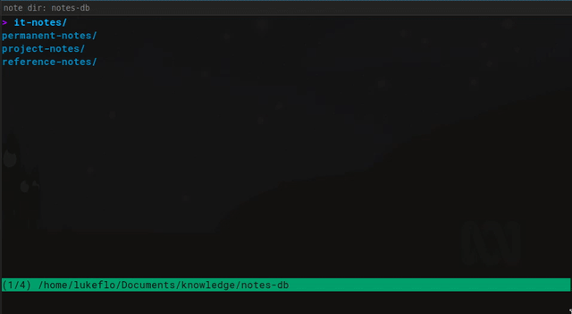

<div align="center">
    <!--  -->
    <h1 align="center">A notes management tool for bash</h1>
      <a href="https://matrix.to/#/#notesbash:matrix.org" rel="noopener" target="_blank"></a>    
</div>

## Declaration

**This is only a copy of the `README`. To get the code and install `notesbash`
visit the main repo at https://codeberg.org/lukeflo/notesbash**

**Issues can also only be opened at Codeberg:
https://codeberg.org/lukeflo/notesbash/issues**

## Introduction

`notesbash` is a tool for **managing** personal notes from the command line. That
means one can use it to create, reorder, move, delete notes; search through them
by keyword/tags or recursivley by filename; link them with entries from your
main `bibtex` file; or simply open a note. All this is done from a TUI inside
your terminal completley written in `bash`.

The editing of file content itself is done using your editor of choice. Thus,
things like syntax highlighting or auto completing the notes text is
handled by the editor, not `notesbash`. But you can specify which editor will be
used. Furthermore, `notesbash` offers configurable templates for different file
formats which makes editing new notes much easier.

## Requirements

`notesbash` doesn't require any uncommon tools, only `bash` and Linux
`coreutils`.

The following commandline tools are used if available to enhance the performance:

+ [ripgrep](https://github.com/BurntSushi/ripgrep)
+ [fzf](https://github.com/junegunn/fzf)
+ [fd(find)](https://github.com/sharkdp/fd)

## Quick Installation

Clone the repo and afterwards run the `make.sh` script from inside the Git
directory. The script checks if it run as root, using `sudo`, or by a local
user. If run as root, it is installed system-wide, else it is installed locally:

```bash
git clone --branch release https://codeberg.org/lukeflo/notesbash
cd notesbash

# To install it for single user only
./make.sh install 

# To install it system-wide
sudo ./make.sh install
```

To uninstall the tool just run `./make.sh uninstall` or `sudo ./make.sh uninstall` 
(depending weather you've installed `notesbash` system-wide or only for a single user) 
from inside the locally cloned Git repository.

For more install options see the
[Wiki](https://codeberg.org/lukeflo/notesbash/wiki/Installation.md).

## Configuration

To configure `notesbash` just edit the configuration file which is installed to
`$XDG_CONFIG_HOME/notesbash/notesbash.conf`. If XDG-convention is not used, the
fallback path ist `~/.config/notesbash/notesbash.conf`.

To work correctly, the following most important variables **should** be set:

**NOTESBASH_ROOT_DIR**
: Set the path to the notes root directory. If variable is not set,
**notesbash** will ask for a temporary directory.

**NOTESBASH_MAIN_BIB**
: Define the path to the main **.bib** file used for bibnotes. If none is found,
some functionality concerning bibnotes might not work.

**NOTESBASH_EDITOR** (Array)
: Enter the favored editor for editing notes. Defaults to $VISUAL, $EDITOR and
at last 'vi' in the given order. You can pass options to the chosen editor. Each
option has to be a single array element.

**NOTESBASH_GUI_EDITOR** (Boolean)
: By default, `notesbash` assumes that your editor is an in-terminal programm. If
you want to use an editor with GUI mode, set the toggle to `true` or `1` so
`notesbash` knows, that it has to open a new window. Typical editors with GUI
mode are "VSCode", "VSCodium", "Kile", "Kate", or "Emacs" with GUI mode (which
is the default).

**NOTESBASH_DEFAULT_EXTENSION**
: Define the common extension which is usually used for the note files. It will
be used to automatically create bibnotes from bibkeys or added to the filename
if the extension was left blank. Defaults to `md` if not set.

**NOTESBASH_FILE_EXTENSIONS** (Array)
: Define file extensions to decide which note files are shown in the TUI. E.g.
`md` for Markdown or `org` for Emacs Org-Mode files (without the dot separating
file name and extension!). If left blank, all files in the directories will be
shown. It's possible to assign multiple files surrounded by parantheses: `(org
md pdf)`.

But `notesbash` offers many more customization possibilities. Check the
[Wiki](https://codeberg.org/lukeflo/notesbash/wiki/Configuration.md) for more
information.

## Usage

`notesbash` is used with an interactive TUI from inside the terminal.

Press `?` from inside the TUI to show possible keybindings, or check the Wiki.

## Demo

A small demo showing what `notesbash` can be used for:



## Licence

All code parts written by me and the other contributors is distributed under the GNU
GPL 3+.

The original code is a fork of the *bash* file manager `fff` by
[**@dylanaraps**](https://github.com/dylanaraps/fff), unmodified code from `fff`
is distributed under the MIT license.

